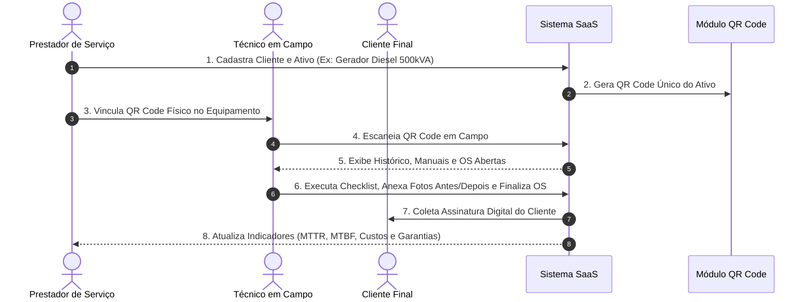

# 🛠️ SaaS Asset Management - Plataforma de Gestão de Ativos para Prestadores de Serviços

> **Plataforma Enterprise de Gestão de Ativos (Asset Management), Manutenção Preventiva e Corretiva, Rastreabilidade por QR Code e Ordens de Serviço Inteligentes.**

[](CHANGELOG.md)
[](LICENSE)
[](docs/README.md)

---

## 📌 Visão Geral do Projeto

Este sistema **não é um simples aplicativo de Ordem de Serviço (OS)**. Trata-se de uma **Plataforma Completa de Gestão de Ativos (Asset Management)** projetada para prestadores de serviços, empresas de manutenção industrial, predial, hospitalar e de infraestrutura.

O sistema transforma qualquer equipamento físico (HVAC, veículos, empilhadeiras, geradores, bombas, transformadores, painéis solares, elevadores, equipamentos de TI e hospitalares) em um **Ativo Digital Inteligente**, acompanhado ao longo de todo o seu ciclo de vida.

---

## 🎯 Objetivo

Oferecer rastreabilidade total, eficiência operacional, automação de processos e confiabilidade técnica para prestadores de serviços através de:

1. **Gestão do Ciclo de Vida do Ativo**: Do cadastro e instalação ao descomissionamento e descarte.
2. **Identificação Única por QR Code**: Acesso imediato à ficha histórica do ativo em campo.
3. **Ordens de Serviço (OS) Dinâmicas**: Automação de checklists, fotos de comprovação (antes/depois) e assinatura digital do cliente.
4. **Manutenção Preventiva e Corretiva Automática**: Programação de SLAs, planos de manutenção e alertas preditivos.
5. **Multitenancy Isolado & Seguro**: Separação rigorosa de dados por empresa (prestador) e clientes finais.

---

## 🚀 Tecnologias Utilizadas

### Core & Frontend
- **HTML5 & Vanilla CSS**: Sistema visual responsivo de alta performance com Tokens CSS, suporte a Dark/Light Mode e Glassmorphism.
- **JavaScript (ESNext)**: Arquitetura baseada em módulos (ES Modules), manipulação reativa do DOM e PWA (Progressive Web App) para uso offline em campo.
- **Iconografia & Diagramas**: Lucide Icons & Mermaid.js para visualização interativa de fluxos.

### Backend & API
- **Node.js / TypeScript**: REST/GraphQL API altamente escalável.
- **Supabase / PostgreSQL**: Banco de dados relacional com **Row Level Security (RLS)** nativo para Multitenancy.
- **Storage / S3 Compatible**: Armazenamento seguro de fotos, laudos técnicos em PDF e assinaturas digitais.

---

## 📐 Arquitetura do Sistema

O sistema segue a arquitetura **Clean Architecture / Layered Architecture**, garantindo o desacoplamento total entre as regras de negócio, serviços de infraestrutura e interfaces visuais.

```mermaid
graph TD
    Client UI[Interface Web / PWA Mobile] --> API Gateway[API Gateway / Router]
    API Gateway --> Auth Layer[Módulo de Autenticação & RLS]
    Auth Layer --> Service Layer[Camada de Serviços & Regras de Negócio]
    
    Service Layer --> Asset Module[Gestão de Ativos - Lifecycle]
    Service Layer --> OS Module[Gestão de Ordens de Serviço]
    Service Layer --> QR Module[Gerador & Leitor QR Code]
    Service Layer --> SLA Module[Motor de Prazos & Preventivas]

    Asset Module --> DB[(PostgreSQL Multitenant)]
    OS Module --> DB
    QR Module --> DB
    SLA Module --> DB

    OS Module --> S3 Storage[(Storage de Fotos & PDFs)]
```

---

## 🔄 Fluxo Geral do Sistema



---

## 📂 Estrutura das Pastas

```
├── docs/                       # Documentação Oficial Completa do Projeto
│   ├── README.md               # Índice da Documentação
│   ├── 01-visao-geral.md       # Visão Geral & Problema Negocial
│   ├── 02-arquitetura.md       # Arquitetura e Diagramas
│   ├── 03-banco-de-dados.md    # DDL, ERD e Constraints
│   ├── 04-fluxos.md            # Fluxos de Processo (Mermaid)
│   ├── 05-regras-de-negocio.md # Regras de Negócio e Validadores
│   ├── 06-componentes.md       # Design System & UI Components
│   ├── 07-api.md               # Endpoints & Contratos REST
│   ├── 08-autenticacao.md      # RBAC, RLS e Multi-tenant Auth
│   ├── 09-storage.md           # Gestão de Mídia & Documentos
│   ├── 10-estrutura-de-pastas.md # Mapeamento do Código Fonte
│   ├── 11-roadmap.md           # Planejamento por Fases (1 a 6)
│   ├── 12-decisoes-tecnicas.md # ADRs (Architecture Decision Records)
│   ├── 13-padroes-de-codigo.md # Linter, Git & Code Style
│   ├── 14-guia-contribuicao.md # Onboarding do Desenvolvedor (< 1 Dia)
│   ├── 15-deploy.md            # CI/CD & Deploy em Nuvem
│   ├── 16-futuras-funcionalidades.md # Backlog de Longo Prazo
│   └── 17-product-bible.md     # A Bíblia do Produto (North Star)
├── CHANGELOG.md                # Histórico Oficial de Alterações
├── README.md                   # Este Arquivo
└── LICENSE                     # Licença MIT
```

---

## 📊 Banco de Dados (Resumo)

O banco de dados utiliza tabelas essenciais para o controle completo de ativos e manutenção:

- `tenants`: Cadastro de Prestadores de Serviços (Multitenant).
- `customers`: Clientes atendidos pelos prestadores.
- `locations`: Locais/Filiais onde os ativos estão instalados.
- `asset_categories`: Categorias flexíveis (Veículos, HVAC, TI, Geradores, etc.).
- `assets`: Entidade central de Ativos (Ciclo de Vida, QR Code, Garantias).
- `work_orders`: Ordens de Serviço (Preventiva, Corretiva, Inspeção).
- `work_order_items`: Peças e serviços executados na OS.
- `checklists`: Listas de verificação pré e pós-manutenção.
- `asset_history`: Log imutável de eventos e alterações do ativo.

Para mais detalhes, consulte a [Documentação de Banco de Dados](docs/03-banco-de-dados.md).

---

## 🛣️ Roadmap do Produto

- **Fase 1 (MVP)**: Cadastro de Ativos, QR Code, OS Básico, Multitenant RLS e PWA Básico.
- **Fase 2 (Financeiro)**: Faturamento de OS, controle de estoque de peças e custos de manutenção.
- **Fase 3 (IA)**: Análise preditiva de falhas, geração de relatórios fotográficos com IA e sugestão de peças.
- **Fase 4 (App Mobile Native)**: Aplicativo iOS e Android nativo para técnicos em campo off-line.
- **Fase 5 (Marketplace)**: Conexão direta entre prestadores e fornecedores de peças/suprimentos.
- **Fase 6 (API Pública)**: Webhooks e rotas para integração com ERPs (SAP, TOTVS, Omie, Conta Azul).

Para o cronograma detalhado, acesse o [Roadmap Completo](docs/11-roadmap.md).

---

## 🛠️ Como Instalar e Executar

### Pré-requisitos
- Node.js >= 18.x
- PostgreSQL >= 15.x ou Supabase CLI

### Passo a Passo
```bash
# 1. Clonar o repositório
git clone https://github.com/palmeirape-ATRIBUICOES/manuten-o.git

# 2. Entrar no diretório
cd manuten-o

# 3. Instalar as dependências
npm install

# 4. Configurar variáveis de ambiente
cp .env.example .env

# 5. Executar o ambiente de desenvolvimento
npm run dev
```

---

## 📄 Licença

Este projeto é disponibilizado sob a licença **MIT**. Veja o arquivo `LICENSE` para mais informações.
