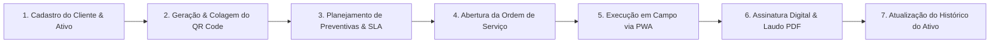

# 01 - Visão Geral do Sistema

## 1. Introdução e Filosofia

O **SaaS Asset Management** é uma plataforma profissional de **Gestão de Ativos Físicos e Ordens de Serviço** desenvolvida para prestadores de serviços técnicos, equipes de manutenção industrial, predial, hospitalar e frotas.

Ao contrário de softwares tradicionais de Ordem de Serviço (OS), que tratam a manutenção como eventos isolados e pontuais, este produto adota a filosofia de **Asset Lifecycle Management (Gestão do Ciclo de Vida de Ativos)**. Nele, cada equipamento é tratado como um **Ativo Patrimonial Vitalício** pertencente a um cliente final e sob a responsabilidade técnica do prestador.

---

## 2. Qual Problema o Sistema Resolve?

### O Cenário Tradicional (Sem o SaaS)
- **Falta de Histórico Confiável**: Ordens de serviço em papel ou planilhas desconexas. Ninguém sabe quando uma peça foi trocada ou se o equipamento está em garantia.
- **Retrabalho e Desdeslocamento Desnecessário**: Técnicos vão ao local sem saber o modelo exato da peça ou ferramenta necessária.
- **Perda de Prazos de Manutenção Preventiva**: Paradas não programadas geram grandes prejuízos para o cliente final.
- **Falta de Transparência para o Cliente**: O cliente não consegue acompanhar a saúde dos seus ativos nem auditar laudos técnicos.

### A Solução do SaaS Asset Management
- **Prontuário Digital do Ativo**: Leitura instantânea via QR Code afixado no equipamento físico.
- **Automação de Manutenção Preventiva**: Cronogramas de inspeção disparados automaticamente com base em calendário ou horas de uso.
- **Comprovação Digital Inviolável**: Checklists obrigatórios com fotos georreferenciadas (antes/depois) e assinatura digital.
- **Portal de Transparência do Cliente**: O cliente final visualiza o status e histórico de seus ativos em tempo real.

---

## 3. Quem é o Cliente? (Target Market)

O sistema foi desenhado para atender três perfis principais:

### A. O Prestador de Serviço (Tenant Primary)
Empresas especializadas que prestam serviços de instalação, reparo, inspeção e manutenção contratada:
- Empresas de Ar Condicionado / HVAC (PMOC).
- Manutenção de Geradores, Transformadores e Painéis Elétricos.
- Manutenção de Empilhadeiras, Guindastes e Máquinas Agrícolas.
- Manutenção de Equipamentos Médicos e Hospitalares.
- Manutenção de Painéis Solares e Sistemas Fotovoltaicos.
- Manutenção de Frotas de Veículos e Utilitários.

### B. O Profissional Técnico (Técnico de Campo)
Equipe operacional que realiza os atendimentos em campo utilizando dispositivo móvel para ler QR Code, preencher checklists, tirar fotos e colher assinaturas.

### C. O Cliente Final (Cliente do Prestador)
Condomínios, indústrias, hospitais, redes de varejo ou clientes corporativos que possuem os ativos e contratam os serviços de manutenção.

---

## 4. Como o Sistema Funciona em Alto Nível

---

## 5. Proposta de Valor e Diferenciais

| Diferencial | Abordagem Tradicional | Abordagem SaaS Asset Management |
|---|---|---|
| **Foco do Sistema** | Apenas emitir uma folha de OS | Gestão patrimonial completa do ativo ao longo de anos |
| **Acesso em Campo** | Formulários em papel ou busca manual em lista | Escaneamento direto via QR Code colado no ativo |
| **Checklist e Mídia** | Notas escritas à mão suscetíveis a erros | Fotos obrigatórias (antes/depois), validações e geolocalização |
| **Garantia de Peças** | Perda de prazos e prejuízos | Alerta automático de garantia de peças instaladas |
| **Arquitetura** | Monolítica / Single Tenant | Multitenant nativo com isolamento por empresa |
