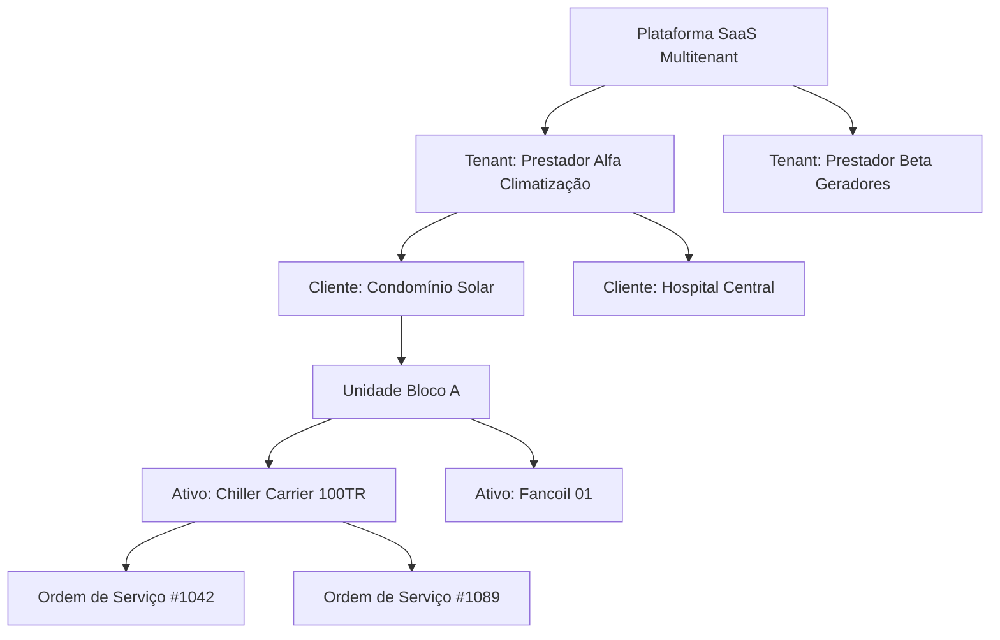

# 02 - Arquitetura do Sistema

## 1. Visão Geral da Arquitetura

O **SaaS Asset Management** adota a arquitetura **Modular Monolith com preparação para Microservices**, estruturado com princípios de **Clean Architecture** (Arquitetura Limpa) e **Domain-Driven Design (DDD)**.

Isso garante que as regras de negócio de **Asset Management** e **Ordens de Serviço** permaneçam puras, isoladas de frameworks visuais ou detalhes de infraestrutura.

---

## 2. Visão Macro de Camadas

```mermaid
graph TB
    subgraph Client Layer [Camada de Apresentação]
        WebClient[Web Application / Dashboard Admin]
        MobilePWA[PWA Mobile - Técnico de Campo]
        PortalClient[Portal de Transparência do Cliente]
    end

    subgraph API Layer [Camada de Entrada / API Gateway]
        Router[API Router & Rate Limiter]
        AuthMiddleware[Auth & Tenant Resolver Middleware]
    end

    subgraph Core Domain Layer [Camada de Domínio / Regras de Negócio]
        AssetDomain[Módulo de Gestão de Ativos]
        OSDomain[Módulo de Ordens de Serviço]
        QRDomain[Módulo de Identificação QR Code]
        ChecklistDomain[Módulo de Checklists & Fotos]
        SLADomain[Motor de Preventivas & SLA]
    end

    subgraph Infrastructure Layer [Camada de Infraestrutura]
        Database[(PostgreSQL - Supabase RLS)]
        ObjectStorage[(S3 / Storage de Mídia)]
        EmailService[Serviço de Notificações / SMS / WhatsApp]
    end

    Client Layer --> API Layer
    API Layer --> Core Domain Layer
    Core Domain Layer --> Infrastructure Layer
```

---

## 3. Hierarquia Multitenant

A aplicação suporta múltiplos prestadores de serviços no mesmo banco de dados com **isolamento de dados estrito por Tenant ID** usando PostgreSQL Row Level Security (RLS).



---

## 4. Comunicação entre Módulos

```mermaid
graph LR
    QRScanner[Leitura do QR Code] --> AssetResolver[Resolve ID do Ativo]
    AssetResolver --> HistoryFetch[Carrega Prontuário & Garantia]
    HistoryFetch --> OSBuilder[Inicia Nova Ordem de Serviço]
    OSBuilder --> ChecklistExec[Aplica Checklist Específico da Categoria]
    ChecklistExec --> PhotoUpload[Upload Foto Antes/Depois]
    PhotoUpload --> SignatureCollect[Coleta Assinatura Digital]
    SignatureCollect --> OSFinish[Finaliza OS & Atualiza Status do Ativo]
```



---

## 5. Princípios de Arquitetura

1. **Desacoplamento de Infraestrutura**: Regras de negócio não dependem do banco de dados ou da biblioteca gráfica.
2. **PostgreSQL RLS Nativo**: Todo comando SQL injeta dinamicamente o `tenant_id` autenticado na sessão.
3. **PWA First**: A interface móvel deve ser leve e resiliente a quedas de conexão de internet durante os atendimentos em campo.
4. **Imutabilidade de Logs**: Toda alteração no estado de um Ativo gera um registro imutável na tabela `asset_history`.
