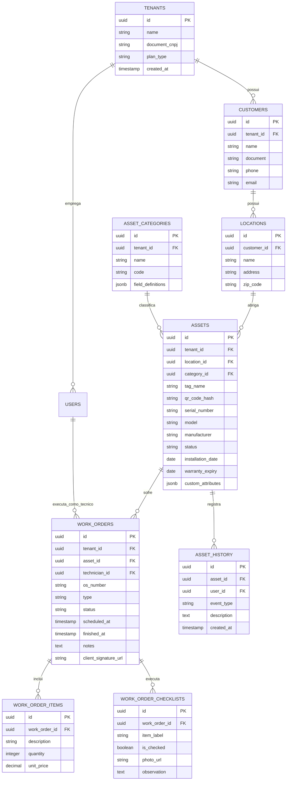

# 03 - Banco de Dados e Modelo ERD

## 1. Visão Geral do Modelo de Dados

O banco de dados foi projetado em **PostgreSQL** com suporte a **Row Level Security (RLS)** para isolamento estrito entre Tenants (Prestadores de Serviços).

A entidade principal é o **Ativo (`assets`)**, estruturada com campos fixos de rastreabilidade (número de série, modelo, QR Code, data de instalação, garantia) e uma coluna de atributos flexíveis em `JSONB` (`custom_attributes`) para comportar qualquer tipo de equipamento físico (Veículos, HVAC, TI, Geradores, Bombas, etc.).

---

## 2. Diagrama Entidade-Relacionamento (ERD)



---

## 3. Detalhamento das Tabelas

### 3.1. Tabela `tenants`
- **Objetivo**: Armazenar os prestadores de serviços cadastrados na plataforma.
- **Campos**:
  - `id` (`uuid`, PK, DEFAULT `gen_random_uuid()`)
  - `name` (`varchar(255)`, NOT NULL)
  - `document_cnpj` (`varchar(20)`, UNIQUE, NOT NULL)
  - `created_at` (`timestamp`, DEFAULT `now()`)
- **Índices**: `idx_tenants_cnpj` ON `document_cnpj`.

### 3.2. Tabela `customers`
- **Objetivo**: Armazenar os clientes pertencentes a cada prestador de serviço.
- **Campos**:
  - `id` (`uuid`, PK)
  - `tenant_id` (`uuid`, FK -> `tenants.id`, NOT NULL)
  - `name` (`varchar(255)`, NOT NULL)
  - `document` (`varchar(20)`)
  - `email` (`varchar(255)`)
- **Constraints**: RLS `tenant_id = auth.current_tenant_id()`.

### 3.3. Tabela `assets` (Central)
- **Objetivo**: Registrar o ativo físico com prontuário completo, ciclo de vida e QR Code.
- **Campos**:
  - `id` (`uuid`, PK)
  - `tenant_id` (`uuid`, FK -> `tenants.id`, NOT NULL)
  - `location_id` (`uuid`, FK -> `locations.id`, NOT NULL)
  - `category_id` (`uuid`, FK -> `asset_categories.id`, NOT NULL)
  - `tag_name` (`varchar(100)`, NOT NULL) — Ex: "GER-01"
  - `qr_code_hash` (`varchar(255)`, UNIQUE, NOT NULL)
  - `serial_number` (`varchar(100)`)
  - `status` (`varchar(50)`, NOT NULL) — Valores: `'INSTALLED'`, `'MAINTENANCE'`, `'DECOMMISSIONED'`, `'ARCHIVED'`.
  - `installation_date` (`date`)
  - `warranty_expiry` (`date`)
  - `custom_attributes` (`jsonb`) — Atributos específicos da categoria (ex: tensão, horímetro, potência, combustível).
- **Índices**:
  - `idx_assets_tenant_id` ON `tenant_id`
  - `idx_assets_qr_code` ON `qr_code_hash`
  - `idx_assets_status` ON `status`

### 3.4. Tabela `work_orders`
- **Objetivo**: Registrar a Ordem de Serviço preventiva ou corretiva vinculada ao Ativo.
- **Campos**:
  - `id` (`uuid`, PK)
  - `tenant_id` (`uuid`, FK)
  - `asset_id` (`uuid`, FK -> `assets.id`)
  - `technician_id` (`uuid`, FK -> `users.id`)
  - `os_number` (`varchar(50)`, UNIQUE) — Ex: "OS-2026-0089"
  - `type` (`varchar(30)`) — `'CORRECTIVE'`, `'PREVENTIVE'`, `'INSPECTION'`
  - `status` (`varchar(30)`) — `'OPEN'`, `'IN_PROGRESS'`, `'WAITING_PARTS'`, `'FINISHED'`, `'CANCELLED'`
  - `client_signature_url` (`text`)
- **Índices**: `idx_wo_asset_status` ON (`asset_id`, `status`).

---

## 4. Políticas de Seguranca RLS (Row Level Security)

```sql
-- Exemplo de política de RLS para a tabela de Ativos
ALTER TABLE assets ENABLE ROW LEVEL SECURITY;

CREATE POLICY tenant_isolation_policy ON assets
    FOR ALL
    USING (tenant_id = current_setting('app.current_tenant_id')::uuid);
```
