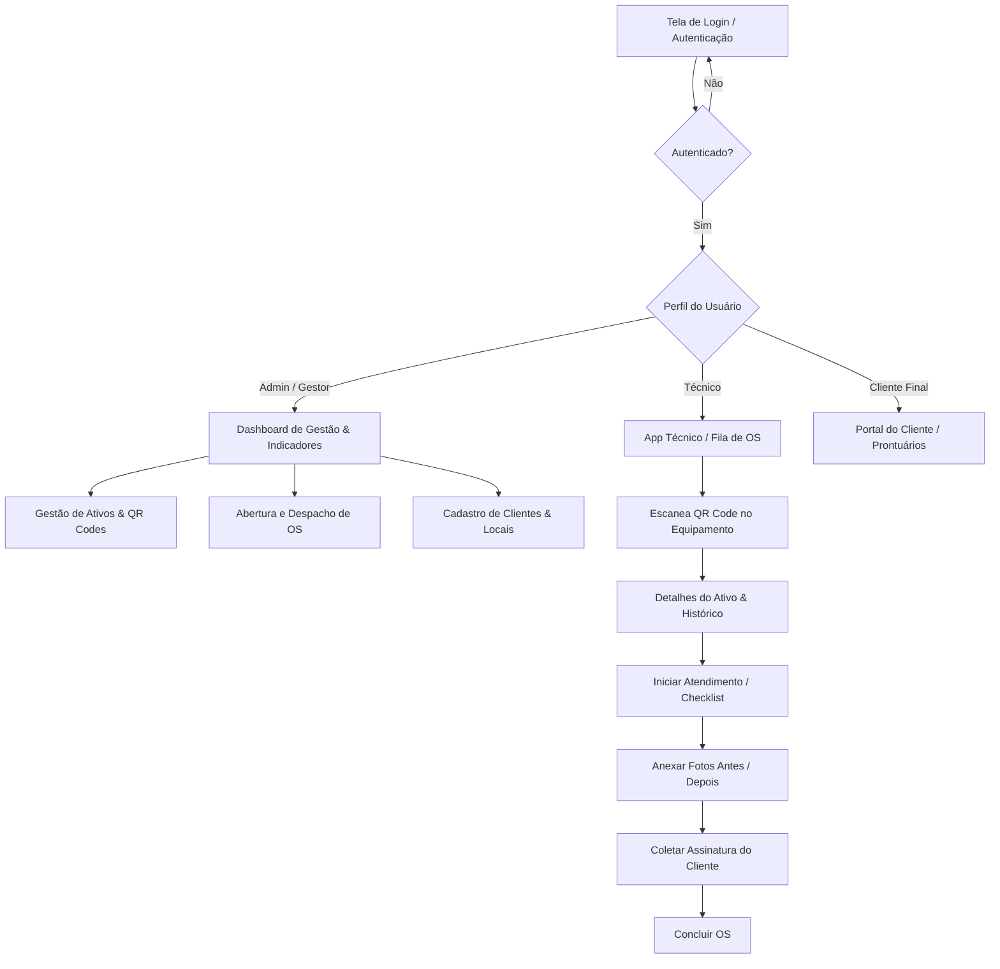
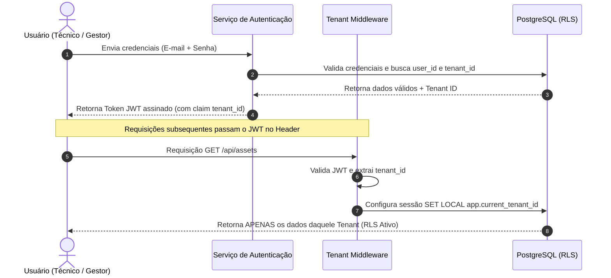
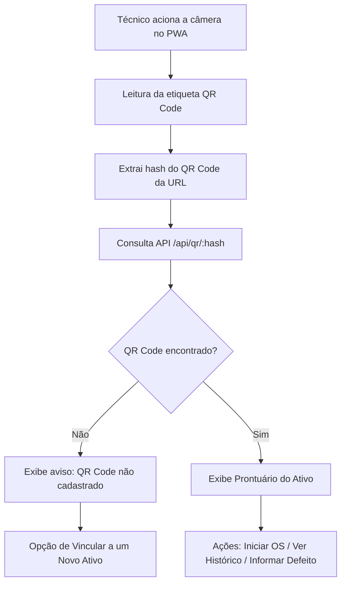
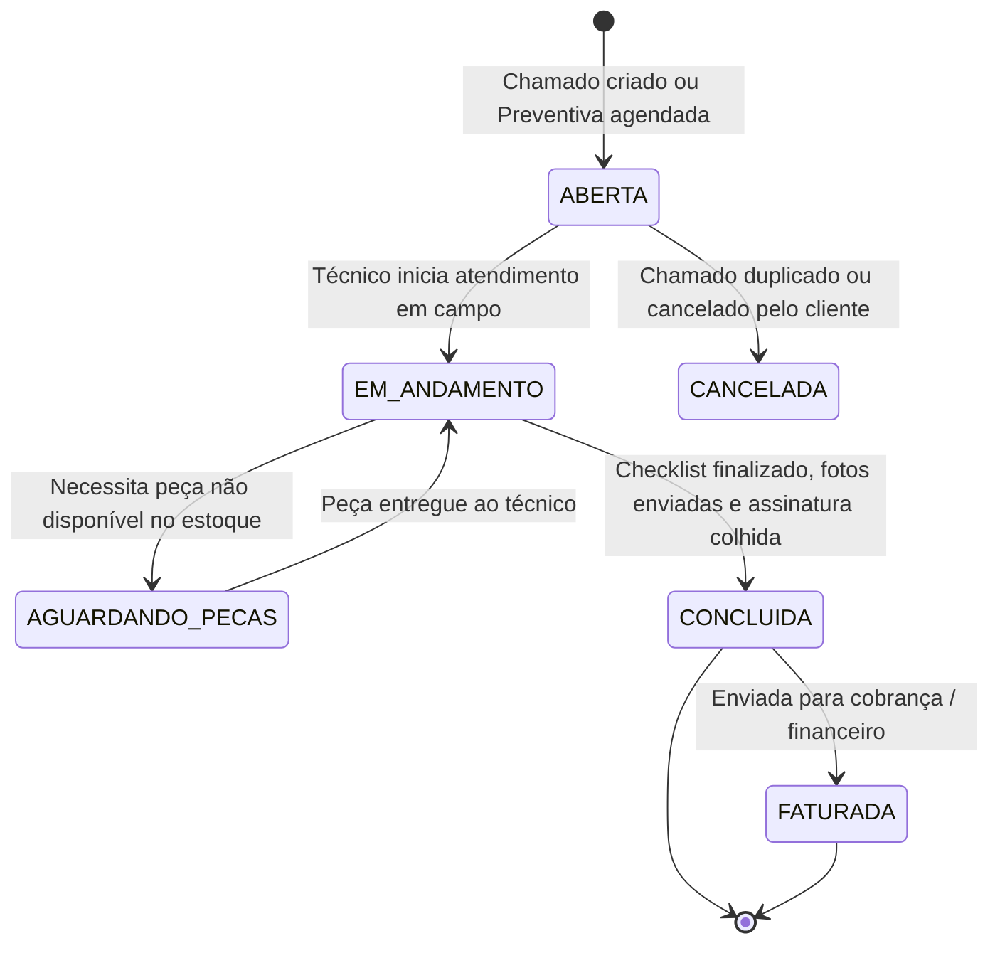
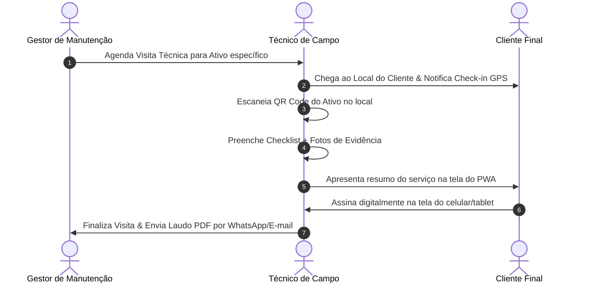

# 04 - Diagramas de Fluxo do Sistema

Este documento apresenta todos os fluxos operacionais e técnicos da aplicação representados graficamente com **Mermaid.js**.

---

## 1. Fluxo Geral de Navegação do Usuário

---

## 2. Fluxo de Autenticação e Multitenancy

---

## 3. Fluxo de Leitura e Validação de QR Code em Campo

---

## 4. Fluxo do Ciclo de Vida da Ordem de Serviço (OS)

---

## 5. Fluxo das Visitas Técnicas

