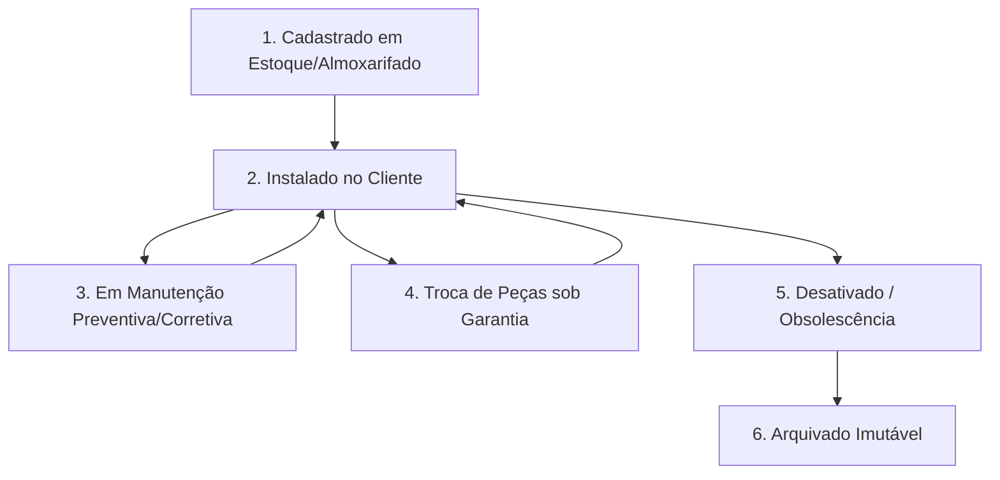

# 05 - Regras de Negócio e Validações Operacionais

## 1. Visão Geral

Este documento descreve as regras de negócio imperativas que governam a plataforma. Todo o código do domínio (services, use cases, validators) deve seguir rigorosamente as especificações aqui descritas.

---

## 2. Regras do Ciclo de Vida do Ativo (Asset Management)

Um equipamento **NÃO é um mero registro de cadastro**. Ele possui um ciclo de vida estrito com transições de estado bem definidas:

### Regras do Ativo:
1. **Unicidade do QR Code**: Cada ativo possui um `qr_code_hash` único no sistema. É proibido reatribuir o mesmo QR Code ativo a outro equipamento sem desativação prévia.
2. **Imutabilidade do Histórico**: Nenhuma alteração no histórico do ativo (`asset_history`) pode ser excluída ou sobrescrita. Eventos de manutenção, troca de peças ou mudanças de local são imutáveis.
3. **Garantia de Peças Instaladas**: Ao registrar a instalação de uma nova peça em uma OS, a data de expiração da garantia da peça é calculada automaticamente. Se houver falha na mesma peça dentro do prazo, o sistema deve sinalizar: **"Atendimento em Garantia de Peça - Sem Custo de Material"**.
4. **Vínculo com Localização**: Um ativo ativo (`status = INSTALLED`) DEVE estar vinculado a um cliente (`customer_id`) e a um local físico específico (`location_id`).

---

## 3. Regras de Ordem de Serviço (OS)

1. **Obrigatoriedade de Foto Antes/Depois**:
   - Para conclusão de Ordens de Serviço do tipo `CORRECTIVE` ou `PREVENTIVE`, o envio de no mínimo **1 foto do estado inicial (antes)** e **1 foto do estado final (depois)** é obrigatório.
2. **Obrigatoriedade do Checklist da Categoria**:
   - Cada categoria de ativo possui um checklist obrigatório. A OS não pode ser encerrada se houver itens marcados como pendentes sem uma observação justificadora.
3. **Assinatura Digital do Cliente**:
   - A OS concluída exige a captura da assinatura do responsável no cliente no próprio dispositivo do técnico ou via link temporário enviado por WhatsApp/SMS.
4. **Número Sequencial da OS**:
   - O número da OS (`os_number`) é gerado de forma sequencial e legível por tenant (Ex: `OS-ALFA-2026-0001`).

---

## 4. Regras de SLA e Preventivas Automáticas

1. **PMOC / Manutenção Preventiva Programada**:
   - Com base no plano de manutenção do ativo (ex: mensal, trimestral, semestral), o sistema gera automaticamente rascunhos de OS de preventiva 7 dias antes do vencimento.
2. **SLA por Criticidade**:
   - Ativos marcados como `CRITICAL` (ex: Gerador de emergência em Hospital) possuem SLA de atendimento corretivo de no máximo **2 horas**. O estouro do SLA gera notificação imediata ao gestor.

---

## 5. Regras de Multitenancy e Permissões (RBAC)

- **ADMIN_TENANT**: Acesso total a ativos, relatórios, configurações e faturamento do seu tenant.
- **GESTOR_TECNICO**: Pode cadastrar ativos, aprovar orçamentos e atribuir OS para técnicos.
- **TECNICO_CAMPO**: Visualiza apenas as OS atribuídas a ele ou abertas no local onde está realizando atendimento. Pode ler QR Code, executar checklist e colher assinatura.
- **CLIENTE_FINAL**: Acesso somente leitura ao portal do cliente, visualizando apenas os ativos e laudos do seu próprio contrato.
