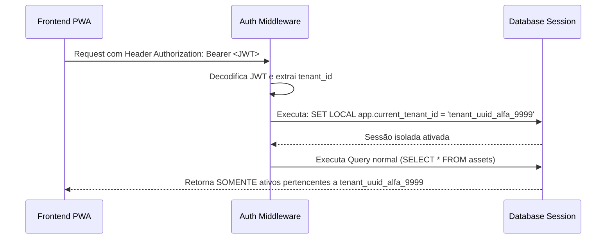

# 08 - Autenticação e Segurança (Auth & RLS)

## 1. Estratégia de Autenticação

A aplicação utiliza **JSON Web Token (JWT)** gerenciado via **Supabase Auth / PostgreSQL Native RLS**.

### Claims contidas no JWT:
```json
{
  "sub": "user_uuid_12345",
  "email": "tecnico@alfa.com.br",
  "role": "TECNICO_CAMPO",
  "tenant_id": "tenant_uuid_alfa_9999",
  "exp": 1754424000
}
```

---

## 2. Injeção de Contexto Multitenant

Para garantir que um prestador jamais acesse dados de outro prestador, a API executa a seguinte rotina a cada requisição HTTP:



---

## 3. Matriz de Controle de Acesso (RBAC)

| Recursos / Ação | ADMIN_TENANT | GESTOR_TECNICO | TECNICO_CAMPO | CLIENTE_FINAL |
|---|:---:|:---:|:---:|:---:|
| Cadastrar/Editar Ativo | ✅ | ✅ | ❌ | ❌ |
| Visualizar Ativo | ✅ | ✅ | ✅ | ✅ (Apenas os seus) |
| Gerar/Imprimir QR Code | ✅ | ✅ | ❌ | ❌ |
| Abrir Ordem de Serviço | ✅ | ✅ | ✅ | ✅ (Solicitação) |
| Executar OS / Checklist | ❌ | ❌ | ✅ | ❌ |
| Assinar OS Finalizada | ❌ | ❌ | ❌ | ✅ |
| Excluir Registros | ✅ | ❌ | ❌ | ❌ |
