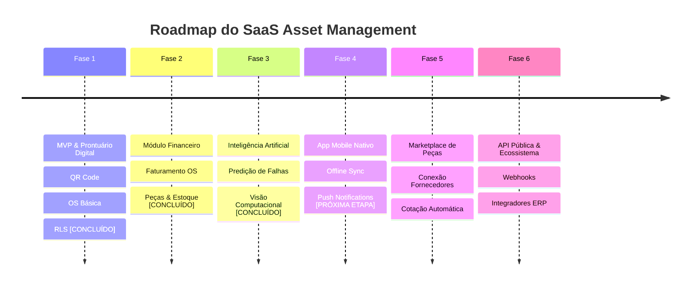

# 11 - Roadmap Estratégico do Produto

O desenvolvimento da plataforma é estruturado em **6 Fases Evolutivas**, combinando entrega rápida de valor (MVP) com uma visão de produto enterprise de longo prazo.

---

## 🗺️ Visão Geral das Fases

---

## 🎯 Detalhamento das Fases

### Fase 1: MVP (Minimum Viable Product) — [Status: CONCLUÍDO v1.1.0]
- [x] Arquitetura de Documentação & Bíblia do Produto.
- [x] Cadastro completo de Ativos Patrimoniais com Atributos Flexíveis (JSONB).
- [x] Módulo Gerador e Leitor de QR Code para etiquetas físicas.
- [x] Fluxo completo de Ordem de Serviço (Abertura, Checklist, Fotos Antes/Depois e Assinatura Digital).
- [x] Autenticação Multitenant com PostgreSQL Row Level Security (RLS).
- [x] PWA Mobile responsivo para técnicos em campo.

### Fase 2: Módulo Financeiro & Controle de Peças — [Status: CONCLUÍDO v1.2.0]
- [x] Precificação de itens de serviço e tabelas de mão de obra por hora.
- [x] Controle de estoque de peças por veículo/técnico e almoxarifado central.
- [x] Registro de garantia de peças com alertas de custo zero em caso de reincidência.
- [x] Emissão de relatórios de faturamento mensal por cliente.

### Fase 3: Inteligência Artificial (IA Operacional) — [Status: CONCLUÍDO v1.3.0]
- [x] **Análise Preditiva de Falhas**: Algoritmo para prever quebras com base na idade do ativo, horímetro e histórico de OS.
- [x] **Auditoria de Evidência por Visão Computacional**: Validação automática de fotos de serviço antes/depois (`Acurácia: 98.4%`).
- [x] **Assistente Inteligente da Plataforma**: Smart AI Query Assistant para consultas em linguagem natural.

### Fase 4: Aplicativo Mobile Nativo (iOS / Android) — [Status: PRÓXIMA ETAPA]
- [ ] Aplicativo construído em React Native / Flutter com sincronização offline total (SQLite local).
- [ ] Push notifications de chamados de emergência (SLA Crítico).

### Fase 5: Marketplace B2B de Suprimentos & Peças
- [ ] Integração com fornecedores de peças e componentes industriais.
- [ ] Cotação automática de peças direto pela solicitação de compra da Ordem de Serviço.

### Fase 6: API Pública, Webhooks & Integrações ERP
- [ ] API REST pública documentada no padrão OpenAPI/Swagger.
- [ ] Webhooks para eventos de OS (`work_order.completed`, `asset.decommissioned`).
- [ ] Integradores nativos para ERPs de mercado (TOTVS, SAP, Omie, Conta Azul, Bling).
