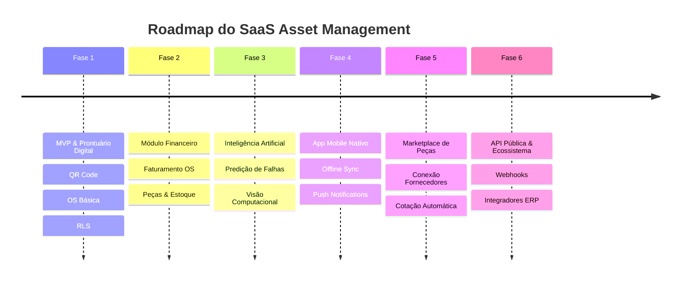

# 11 - Roadmap Estratégico do Produto

O desenvolvimento da plataforma é estruturado em **6 Fases Evolutivas**, combinando entrega rápida de valor (MVP) com uma visão de produto enterprise de longo prazo.

---

## 🗺️ Visão Geral das Fases

---

## 🎯 Detalhamento das Fases

### Fase 1: MVP (Minimum Viable Product) — [Status: EM DESENVOLVIMENTO]
- [x] Arquitetura de Documentação & Bíblia do Produto.
- [ ] Cadastro completo de Ativos Patrimoniais com Atributos Flexíveis (JSONB).
- [ ] Módulo Gerador e Leitor de QR Code para etiquetas físicas.
- [ ] Fluxo completo de Ordem de Serviço (Abertura, Checklist, Fotos Antes/Depois e Assinatura Digital).
- [ ] Autenticação Multitenant com PostgreSQL Row Level Security (RLS).
- [ ] PWA Mobile responsivo para técnicos em campo.

### Fase 2: Módulo Financeiro & Controle de Peças
- [ ] Precificação de itens de serviço e tabelas de mão de obra.
- [ ] Controle de estoque de peças por veículo/técnico.
- [ ] Registro de garantia de peças com alertas de custo zero em caso de reincidência.
- [ ] Emissão de relatórios de faturamento mensal por cliente.

### Fase 3: Inteligência Artificial (IA Operacional)
- [ ] **Visão Computacional**: Leitura automática de placas de identificação de equipamentos para preenchimento de cadastro.
- [ ] **Análise Preditiva de Falhas**: Algoritmo para prever quebras com base na idade do ativo, horímetro e histórico de OS.
- [ ] **Auditoria de Checklist por IA**: Validação se a foto enviada pelo técnico realmente corresponde à peça corrigida.

### Fase 4: Aplicativo Mobile Nativo (iOS / Android)
- [ ] Aplicativo construído em React Native / Flutter com sincronização offline total (SQLite local).
- [ ] Push notifications de chamados de emergência (SLA Crítico).

### Fase 5: Marketplace B2B de Suprimentos & Peças
- [ ] Integração com fornecedores de peças e componentes industriais.
- [ ] Cotação automática de peças direto pela solicitação de compra da Ordem de Serviço.

### Fase 6: API Pública, Webhooks & Integrações ERP
- [ ] API REST pública documentada no padrão OpenAPI/Swagger.
- [ ] Webhooks para eventos de OS (`work_order.completed`, `asset.decommissioned`).
- [ ] Integradores nativos para ERPs de mercado (TOTVS, SAP, Omie, Conta Azul, Bling).
