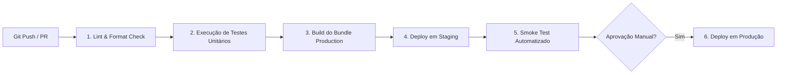

# 15 - Pipeline de Deploy e Infraestrutura CI/CD

## 1. Ambientes de Execução

| Ambiente | Branch | URL de Acesso | Banco de Dados |
|---|---|---|---|
| **Development** | `develop` | `http://localhost:3000` | Local / Supabase Local |
| **Staging** | `staging` | `https://staging.saas.com` | Supabase Staging DB |
| **Production** | `main` | `https://app.saas.com` | Supabase Production DB (HA) |

---

## 2. Pipeline de CI/CD (GitHub Actions)

Todo Push ou Pull Request para as branches `main` e `staging` dispara automaticamente o workflow de integração contínua:

---

## 3. Checklist Pré-Deploy

- [ ] Todas as migrações DDL do banco de dados foram testadas retrocompativelmente.
- [ ] O arquivo `CHANGELOG.md` foi atualizado.
- [ ] Nenhuma credencial de API ou segredo foi commitado no código.
