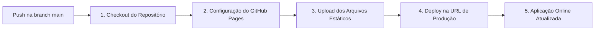

# 15 - Pipeline de Deploy e Infraestrutura CI/CD

## 1. Deploy Contínuo Automático (Produção Online)

O projeto está configurado para **deploy automático em Produção** via **GitHub Pages & GitHub Actions**.

- **URL de Produção**: [https://palmeirape-atribuicoes.github.io/manuten-o/](https://palmeirape-atribuicoes.github.io/manuten-o/)
- **Repositório GitHub**: [https://github.com/palmeirape-ATRIBUICOES/manuten-o](https://github.com/palmeirape-ATRIBUICOES/manuten-o)

---

## 2. Pipeline de CI/CD (GitHub Actions)

A cada commit/push na branch `main`, a Action [.github/workflows/deploy.yml](file:///c:/Users/thiag/OneDrive/Área%20de%20Trabalho/PRESTADOR%20DE%20SERVIÇOS/.github/workflows/deploy.yml) é disparada automaticamente:

---

## 3. Autonomia de Deploy

Conforme diretriz do projeto, todas as atualizações de sprints, documentação, novas funcionalidades e correções de bugs são publicadas **diretamente em produção** no GitHub sem necessidade de aprovações manuais intermediárias.
