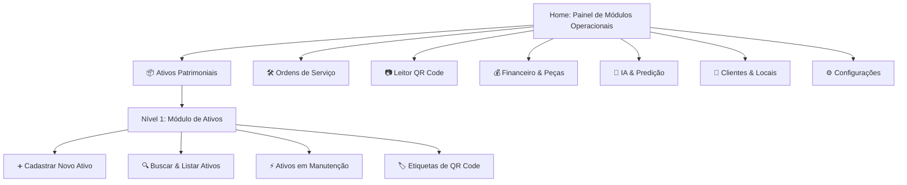

# 17 - Bíblia do Produto (Product Bible)

> **O Guia Supremo do Produto (North Star Document)**  
> *Este documento é a referência definitiva sobre a visão, filosofia, posicionamento de mercado, personas, modelo de negócios e os princípios fundamentais imutáveis do sistema SaaS Asset Management. Qualquer decisão de funcionalidade ou arquitetura DEVE consultar e respeitar este documento.*

---

## 📋 Sumário
1. [Visão Geral e Filosofia Central](#1-visão-geral-e-filosofia-central)
2. [O Problema Que Resolvemos](#2-o-problema-que-resolvemos)
3. [Arquitetura Visual e Padrão de Navegação por Blocos](#3-arquitetura-visual-e-padrão-de-navegação-por-blocos)
4. [Posicionamento de Mercado e Diferenciais](#4-posicionamento-de-mercado-e-diferenciais)
5. [Personas e Jornadas do Usuário](#5-personas-e-jornadas-do-usuário)
6. [O Ciclo de Vida Universal do Ativo (Asset Lifecycle)](#6-o-ciclo-de-vida-universal-do-ativo-asset-lifecycle)
7. [Modelo de Monetização e Regras de Negócio](#7-modelo-de-monetização-e-regras-de-negócio)
8. [Os Princípios Imutáveis do Sistema](#8-os-princípios-imutáveis-do-sistema)

---

## 1. Visão Geral e Filosofia Central

### A Filosofia do Ativo
Este sistema **NÃO É UM SIMPLES APLICATIVO DE ORDEM DE SERVIÇO**.  
Sistemas tradicionais de Ordem de Serviço tratam a manutenção como eventos desconexos e descartáveis. Para nós, **um equipamento nunca é apenas um equipamento: ele é um ATIVO PATRIMONIAL VITALÍCIO do cliente.**

Seja um ar-condicionado central, uma empilhadeira, um gerador elétrico, um trator, um gerador fotovoltaico ou um tomógrafo hospitalar, cada ativo possui uma **identidade digital única (QR Code)**, uma **história**, um **custo de manutenção** e um **ciclo de vida** que deve ser rastreado do nascimento à aposentadoria.

---

## 2. O Problema Que Resolvemos

### 🔴 As Dores do Prestador de Serviços
1. **Falta de Prova Incontestável**: Clientes contestam se o serviço foi prestado ou alegam que o defeito persistiu.
2. **Perda de Histórico de Peças**: Peças trocadas na garantia são cobradas novamente ou peças pagas não possuem rastreabilidade de quem instalou e quando.
3. **Equipes de Campo Ineficientes**: Técnicos perdem tempo procurando manuais, modelos de peças ou localizando equipamentos dentro de grandes plantas industriais/prediais.
4. **Faturamento Atrasado**: Ordens de serviço em papel demoram dias para chegar ao escritório e virar fatura.

---

## 3. Arquitetura Visual e Padrão de Navegação por Blocos

O sistema adota estritamente o **Padrão de Navegação por Blocos em Níveis (Block-Based Navigation Architecture)**, inspirado no projeto de referência `missoes-da-loja`.

### Diretrizes de Navegação e UX:
- **Sem Sidebars / Sem Menus Hambúrguer**: Toda navegação ocorre exclusivamente por meio de blocos (cards) grandes e visíveis.
- **Navegação em Níveis**: Cada clique avança um nível na pilha de navegação (`Level Navigation Stack`).
- **Botão Voltar Permanente**: O usuário sempre visualiza o botão `← Voltar ao Nível Anterior` e o rastro de navegação (`Breadcrumbs`).
- **Regra dos 8 Blocos**: Nenhuma tela exibirá mais do que **8 blocos principais**. Se um módulo crescer além desse limite, deverá ser subdividido em sub-níveis.
- **Garantia de 3 Clicks**: Qualquer funcionalidade ou informação do sistema deve ser acessível em no máximo **3 cliques** a partir da tela inicial.

---

## 4. Posicionamento de Mercado e Diferenciais

- **Foco Absoluto no Ativo**: Construído em volta da saúde do ativo patrimonial, e não de papéis de OS.
- **QR Code Nativo & Offline-First**: O técnico escaneia a etiqueta no equipamento e abre o prontuário completo instantaneamente, mesmo em subsolos ou sem internet.
- **Navegação Limpa por Blocos**: Interface sem poluição visual onde o técnico e o gestor nunca enxergam dezenas de botões irrelevantes ao mesmo tempo.

---

## 5. Personas e Jornadas do Usuário

### Persona 1: Carlos, O Dono do Prestador de Serviço
- **Perfil**: Empresário de empresa de manutenção com 15 técnicos em campo.
- **Objetivo**: Aumentar a margem de lucro, reduzir reclamações de clientes e controlar o trabalho da equipe.
- **Jornada**: Clica no bloco `Financeiro & Peças` -> seleciona `Faturamento por Cliente` para visualizar o resumo de cobrança mensal.

### Persona 2: Roberto, O Técnico de Campo
- **Perfil**: Profissional operacional que realiza de 6 a 10 atendimentos por dia.
- **Objetivo**: Resolver o problema rapidamente sem burocracia ou papelada.
- **Jornada**: Clica no bloco `Leitor QR Code`, escaneia a etiqueta do equipamento, seleciona a ação `Executar OS`, realiza o checklist com foto e colhe a assinatura no celular.

---

## 6. O Ciclo de Vida Universal do Ativo (Asset Lifecycle)

Todo ativo cadastrado no sistema obrigatoriamente percorre as seguintes fases:
1. Cadastro & QR Code -> 2. Instalação no Cliente -> 3. Operação & Preventivas PMOC -> 4. Intervenções Corretivas & Peças -> 5. Gestão de Garantia de Componentes -> 6. Obsolescência / Descomissionamento -> 7. Arquivamento Histórico Imutável.

---

## 7. Modelo de Monetização e Regras de Negócio

O SaaS adota o modelo de receita recorrente **B2B Subscription (SaaS)** em 3 planos: Starter, Professional e Enterprise.

---

## 8. Os Princípios Imutáveis do Sistema

1. **O Ativo é o Centro de Tudo**: Nenhuma Ordem de Serviço pode existir sem estar vinculada a um Ativo ou Localização.
2. **Navegação Exclusiva por Blocos**: É proibida a inclusão de menus laterais (sidebars) ou menus hambúrguer. A navegação deve ser sempre baseada em blocos e níveis com botão "Voltar".
3. **Regra dos 8 Blocos e 3 Clicks**: Nenhuma tela pode conter mais de 8 botões/cards principais. Qualquer função deve ser alcançada em no máximo 3 cliques.
4. **Comprovação com Evidência Visual & IA**: Toda OS concluída exige fotos auditadas por visão computacional.
5. **Isolamento Multitenant Absoluto**: Isolamento estrito de dados por `tenant_id` com PostgreSQL RLS.
6. **Histórico Imutável**: Prontuários e trocas de peças passadas nunca podem ser apagados ou alterados.
