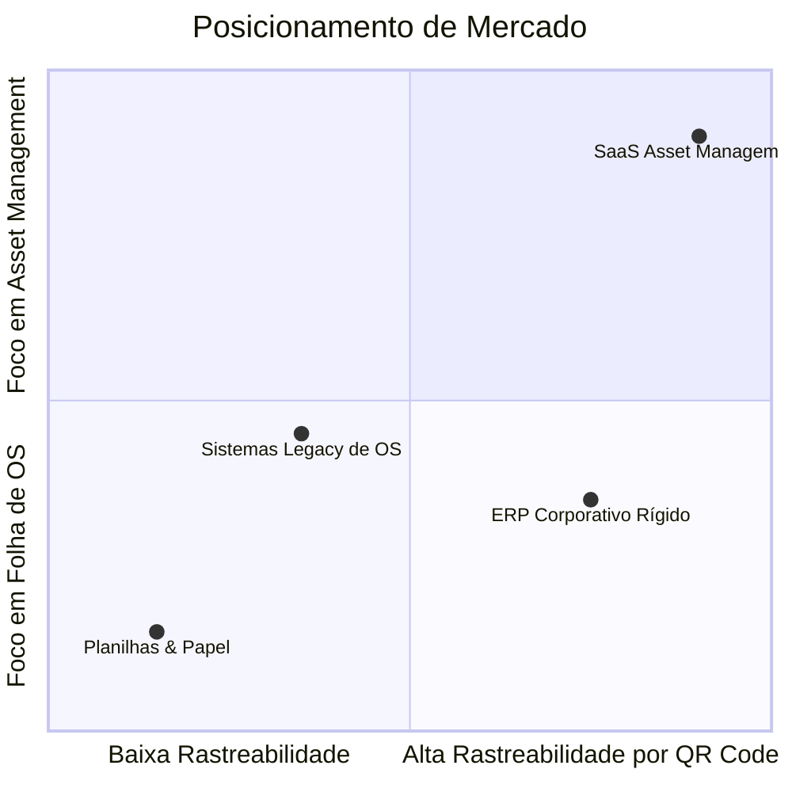
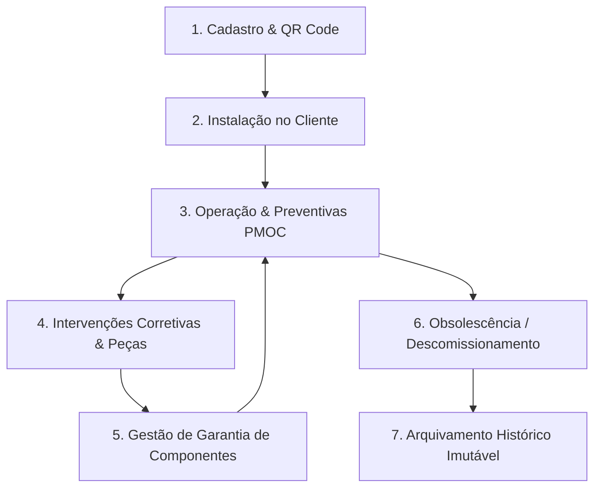

# 17 - Bíblia do Produto (Product Bible)

> **O Guia Supremo do Produto (North Star Document)**  
> *Este documento é a referência definitiva sobre a visão, filosofia, posicionamento de mercado, personas, modelo de negócios e os princípios fundamentais imutáveis do sistema SaaS Asset Management. Qualquer decisão de funcionalidade ou arquitetura DEVE consultar e respeitar este documento.*

---

## 📋 Sumário
1. [Visão Geral e Filosofia Central](#1-visão-geral-e-filosofia-central)
2. [O Problema Que Resolvemos](#2-o-problema-que-resolvemos)
3. [Posicionamento de Mercado e Diferenciais](#3-posicionamento-de-mercado-e-diferenciais)
4. [Personas e Jornadas do Usuário](#4-personas-e-jornadas-do-usuário)
5. [O Ciclo de Vida Universal do Ativo (Asset Lifecycle)](#5-o-ciclo-de-vida-universal-do-ativo-asset-lifecycle)
6. [Modelo de Monetização e Regras de Negócio](#6-modelo-de-monetização-e-regras-de-negócio)
7. [Matriz de Casos de Uso Principais](#7-matriz-de-casos-de-uso-principais)
8. [Os 7 Princípios Imutáveis do Sistema](#8-os-7-princípios-imutáveis-do-sistema)

---

## 1. Visão Geral e Filosofia Central

### A Filosofia do Ativo
Este sistema **NÃO É UM SIMPLES APLICATIVO DE ORDEM DE SERVIÇO**.  
Sistemas tradicionais de Ordem de Serviço tratam a manutenção como eventos desconexos e descartáveis. Para nós, **um equipamento nunca é apenas um equipamento: ele é um ATIVO PATRIMONIAL VITALÍCIO do cliente.**

Seja um ar-condicionado central, uma empilhadeira, um gerador elétrico, um trator, um gerador fotovoltaico ou um tomógrafo hospitalar, cada ativo possui uma **identidade digital única (QR Code)**, uma **história**, um **custo de manutenção** e um **ciclo de vida** que deve ser rastreado do nascimento à aposentadoria.

### Visão de Longo Prazo
Ser a plataforma SaaS padrão global para prestadores de serviços de manutenção técnica, transformando a gestão patrimonial física em uma experiência digital inteligente, transparente e altamente rentável.

---

## 2. O Problema Que Resolvemos

### 🔴 As Dores do Prestador de Serviços
1. **Falta de Prova Incontestável**: Clientes contestam se o serviço foi prestado ou alegam que o defeito persistiu.
2. **Perda de Histórico de Peças**: Peças trocadas na garantia são cobradas novamente ou peças pagas não possuem rastreabilidade de quem instalou e quando.
3. **Equipes de Campo Ineficientes**: Técnicos perdem tempo procurando manuais, modelos de peças ou localizando equipamentos dentro de grandes plantas industriais/prediais.
4. **Faturamento Atrasado**: Ordens de serviço em papel demoram dias para chegar ao escritório e virar fatura.

### 🔴 As Dores do Cliente Final (Dono do Ativo)
1. **Opacidade Total**: O cliente paga contratos mensais de manutenção, mas não sabe o real estado de saúde dos seus equipamentos.
2. **Paradas Não Programadas (Downtime)**: Equipamentos quebram repentinamente por falta de manutenção preventiva sistemática.
3. **Incapaz de Auditar a Garantia**: Desconhece quais componentes ainda estão cobertos pela garantia do fabricante ou do prestador.

---

## 3. Posicionamento de Mercado e Diferenciais

### Por que venceremos a concorrência?
- **Foco Absoluto no Ativo**: Construído em volta da saúde do ativo patrimonial, e não de papéis de OS.
- **QR Code Nativo & Offline-First**: O técnico escaneia a etiqueta no equipamento e abre o prontuário completo instantaneamente, mesmo em subsolos ou sem internet.
- **Transparência como Serviço**: Oferecemos um portal exclusivo onde o cliente final acompanha a saúde dos seus ativos em tempo real, gerando retenção de contratos para o prestador.

---

## 4. Personas e Jornadas do Usuário

### Persona 1: Carlos, O Dono do Prestador de Serviço
- **Perfil**: Empresário de empresa de manutenção com 15 técnicos em campo.
- **Objetivo**: Aumentar a margem de lucro, reduzir reclamações de clientes e controlar o trabalho da equipe.
- **Jornada**: Acessa o Dashboard Admin pela manhã, visualiza o mapa de OSs em andamento, analisa os índices de SLA e foca na expansão dos contratos.

### Persona 2: Roberto, O Técnico de Campo
- **Perfil**: Profissional operacional que realiza de 6 a 10 atendimentos por dia.
- **Objetivo**: Resolver o problema rapidamente sem burocracia ou papelada.
- **Jornada**: Chega ao cliente, aproxima o smartphone do QR Code colado no ativo, visualiza o histórico do equipamento, executa o checklist visual, tira fotos de evidência (Antes/Depois), colhe a assinatura no celular e parte para a próxima chamada.

### Persona 3: Amanda, A Gestora do Cliente Final (Síndica / Gerente Predial)
- **Perfil**: Responsável por manter os ativos do condomínio ou indústria operantes.
- **Objetivo**: Ter relatórios claros e certeza de que as manutenções contratadas foram realmente executadas.
- **Jornada**: Recebe um link por e-mail/WhatsApp assim que o técnico conclui a OS, abre o laudo em PDF com fotos e histórico do ativo, e aprova a execução.

---

## 5. O Ciclo de Vida Universal do Ativo (Asset Lifecycle)

Todo ativo cadastrado no sistema obrigatoriamente percorre as seguintes fases:

### Mapeamento dos Ativos Suportados:
A arquitetura foi projetada para suportar qualquer patrimônio físico:
- **HVAC**: Chillers, Splitters, Torres de Resfriamento, Fancoils (Norma PMOC).
- **Energia**: Geradores Diesel, No-breaks, Transformadores, Painéis Solares.
- **Frota & Logística**: Empilhadeiras, Guindastes, Caminhões, Veículos Utilitários.
- **Industrial**: Bombas Hidráulicas, Motores Elétricos, Compressores, Prensas.
- **Hospitalar**: Tomógrafos, Monitores Cardíacos, Autoclaves, Raio-X.
- **Infraestrutura**: Elevadores, Portões Automáticos, Sistemas de Alarme e Incêndio.

---

## 6. Modelo de Monetização e Regras de Negócio

O SaaS adota o modelo de receita recorrente **B2B Subscription (SaaS)** baseado em camadas:

1. **Plano Starter**: Até 200 Ativos Cadastrados + 3 Técnicos.
2. **Plano Professional**: Até 1.500 Ativos + 10 Técnicos + Módulo de Preventivas Automáticas + QR Codes ilimitados.
3. **Plano Enterprise**: Ativos Ilimitados + Técnicos Ilimitados + API Pública + RLS Dedicado + Portal do Cliente Customizado com Marca Própria (White-label).

---

## 7. Matriz de Casos de Uso Principais

| ID | Caso de Uso | Ator Principal | Descrição Sintética |
|---|---|---|---|
| **UC01** | Cadastrar Ativo & Gerar QR | Gestor / Técnico | Registra o equipamento, define a categoria, atributos e imprime o QR Code. |
| **UC02** | Ler QR Code em Campo | Técnico de Campo | Escaneia a etiqueta física e carrega o prontuário e histórico de OS daquele ativo. |
| **UC03** | Executar OS com Checklist | Técnico de Campo | Preenche checklist obrigatório, anexa foto inicial e final e colhe assinatura. |
| **UC04** | Programar Preventivas | Gestor Técnico | Configura frequência de inspeção e o sistema gera as OSs automaticamente. |
| **UC05** | Consultar Prontuário | Cliente Final | Acessa a página pública/privada do ativo e lê todos os laudos técnicos passados. |

---

## 8. Os 7 Princípios Imutáveis do Sistema

Estes princípios **NUNCA DEVEM SER VIOLADOS** em nenhuma atualização ou nova funcionalidade:

1. **O Ativo é o Centro de Tudo**: Nenhuma Ordem de Serviço pode existir "flutuando" no sistema sem estar vinculada a um Ativo ou Localização cadastrada.
2. **O QR Code é a Ponte Física-Digital**: Todo ativo físico deve possuir uma identidade digital escaneável por QR Code.
3. **Comprovação com Evidência Visual**: Toda OS concluída exige fotos reais (antes/depois) e validação digital.
4. **Isolamento Multitenant Absoluto**: Os dados de um prestador ou de seus clientes jamais podem vazar para outro tenant.
5. **Histórico Imutável**: O prontuário de um ativo é um documento auditável. Registros passados de manutenção nunca podem ser apagados ou adulterados.
6. **Simplicidade Extrema para o Técnico**: A interface de campo deve exigir o mínimo de toques possível, funcionando em dispositivos de baixo custo e com internet instável.
7. **Transparência Gera Retenção**: A plataforma deve sempre facilitar a entrega de relatórios claros e impecáveis para o cliente final.
